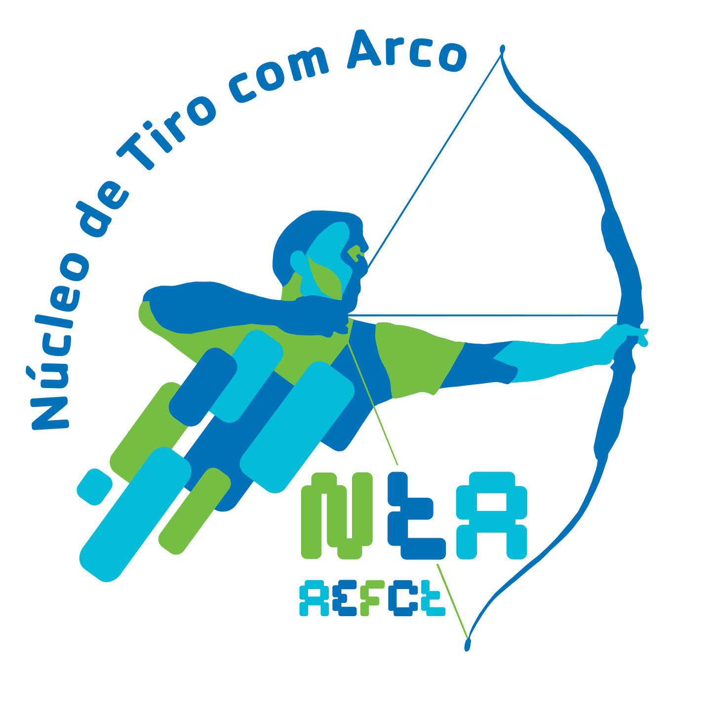

## IPM - Grupo 21

## GameWrap: Wrap Together

No contexto da cadeira de Interação Pessoa-Máquina, desenvolvemos a aplicação GameWrap, uma plataforma para artistas e game developers para partilharem os seus projetos e encontrarem pessoas na sua área de trabalho.

## Elementos

António Santos
nº 51879
MIEI

Fredrico Pinheiro
nº 52794
MIEI

João Rodrigues
nº 53349
MIEI

Pedro Bailão
nº 53675
MIEI

## Evolução do Logótipo

Protótipo

Fase 1

Fase 2


# Header 1
## Header 2
### Header 3

```markdown
Syntax highlighted code block
- Bulleted
- List


1. Numbered
2. List

**Bold** and _Italic_ and `Code` text

[Link](url)https://p2.trrsf.com/image/fget/cf/600/400/images.terra.com/2020/08/14/o-gatinho-de-cada-signo-15721.jpeg[Image](src)
```

For more details see [GitHub Flavored Markdown](https://guides.github.com/features/mastering-markdown/).

### Jekyll Themes

Your Pages site will use the layout and styles from the Jekyll theme you have selected in your [repository settings](https://github.com/TonyZS/IPM21/settings). The name of this theme is saved in the Jekyll `_config.yml` configuration file.

### Support or Contact

Having trouble with Pages? Check out our [documentation](https://docs.github.com/categories/github-pages-basics/) or [contact support](https://github.com/contact) and we’ll help you sort it out.
