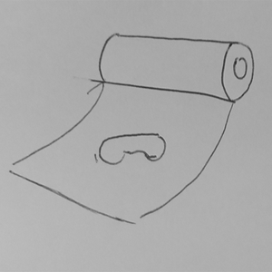
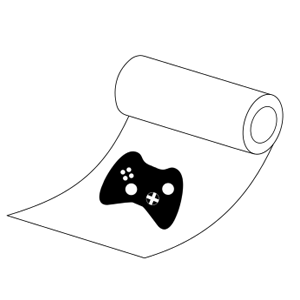
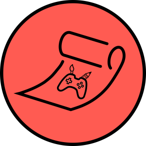

# IPM - Grupo 21

# GameWrap: Wrap Together

No contexto da cadeira de Interação Pessoa-Máquina, desenvolvemos a aplicação GameWrap, uma plataforma para artistas e game developers para partilharem os seus projetos e encontrarem pessoas na sua área de trabalho.

## Elementos

António Santos
nº 51879
MIEI

Fredrico Pinheiro
nº 52794
MIEI

João Rodrigues
nº 53349
MIEI

Pedro Bailão
nº 53675
MIEI

## Evolução do Logótipo

### Protótipo

### Fase 1

### Fase 2

## Relatórios

<a href="IPM_stage_1_51879_52794_53349_53675.pdf">Stage 1</a> 
<a href="IPM_stage2_21_51879_52794_53349_53675.pdf">Stage 2</a> 
<a href="G_21_stage3.pdf">Stage 3</a>

## Assignment1

### António Santos
Bad Design:

-Playstation Store Search Bar

Good Design:

