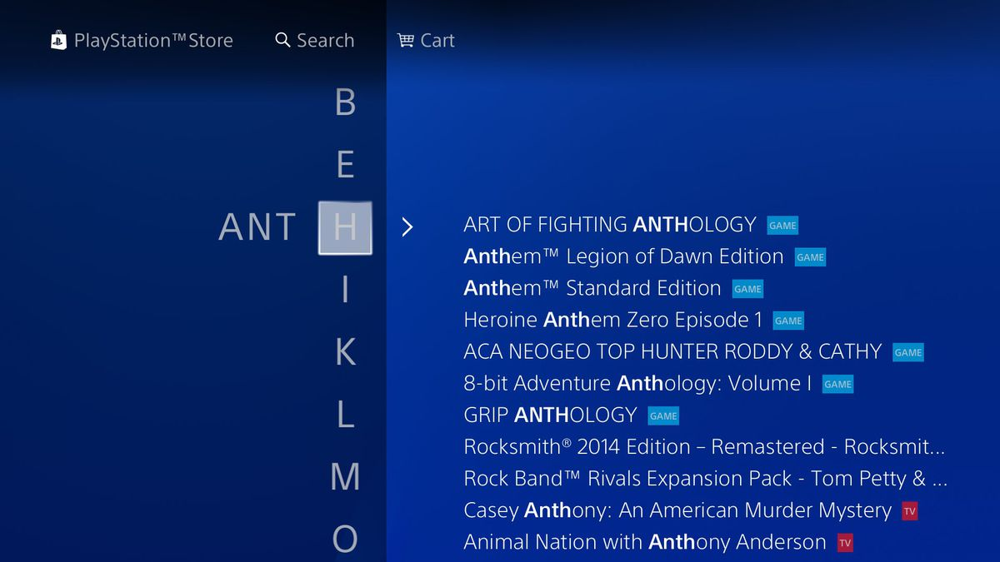
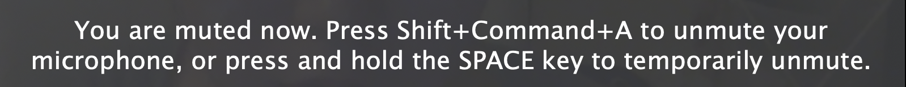

# IPM - Grupo 21

# GameWrap: Wrap Together

No contexto da cadeira de Interação Pessoa-Máquina, desenvolvemos a aplicação GameWrap, uma plataforma para artistas e game developers para partilharem os seus projetos e encontrarem pessoas na sua área de trabalho.

## Elementos

António Santos
nº 51879
MIEI

Fredrico Pinheiro
nº 52794
MIEI

João Rodrigues
nº 53349
MIEI

Pedro Bailão
nº 53675
MIEI

## Fase 1
<a href="IPM_stage_1_51879_52794_53349_53675.pdf">Relatório</a> 

## Fase 2
<a href="IPM_stage2_21_51879_52794_53349_53675.pdf">Relatório</a> 

## Fase 3 - Marvel
<a href="G_21_stage3.pdf">Relatório</a>

<a href="https://marvelapp.com/prototype/267g382g/screen/73968340">Link Marvel</a>

## Fase 4 - Protótipo
<a href="IPM_stage_4.pdf">Relatório</a>

<a href="https://personal-eg5wulr8.outsystemscloud.com/GameWrap/EmDestaque?_ts=637423436191169044">Link Protótipo</a>

## Evolução do Logótipo

### Protótipo

### Fase 1

### Fase 2

## Assignment1

### António Santos
Bad Design:

-Playstation Store Search Bar

Good Design:

-Zoom Muted Notification

### João Rodrigues
<a href="IPM Interfaces.pdf">Interfaces</a>

